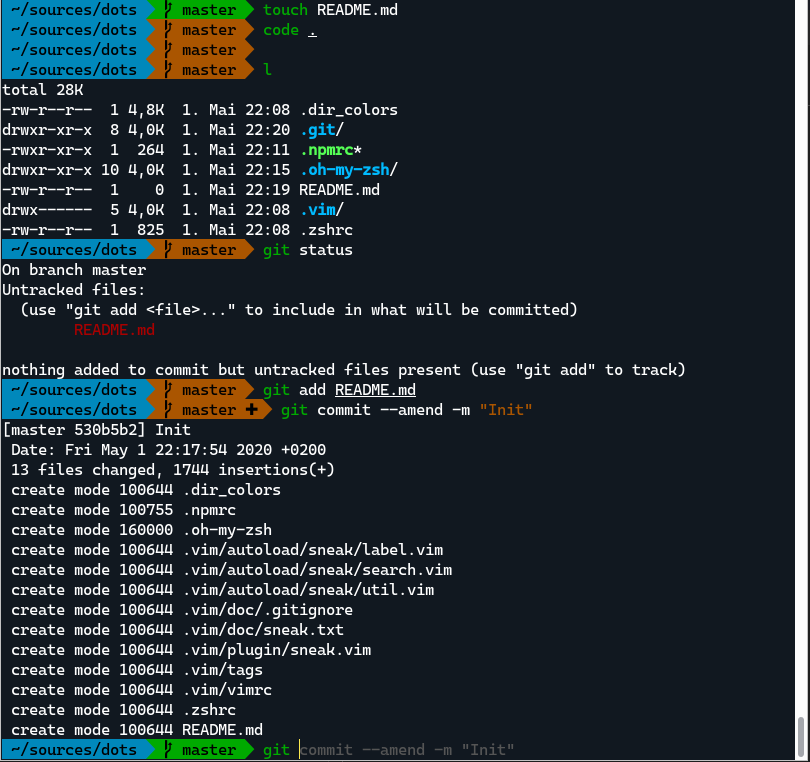

# Dotfiles for fast init

## Usage

- Just copy the stuff you need to ~
- Install zsh
- Install a font with powerline support (I'm using [Cascade Code](https://github.com/microsoft/cascadia-code)
- Done.

## Contents

- [oh-my-zsh](https://github.com/ohmyzsh/ohmyzsh) with enabled plugins:
  - [zsh-autosuggestions](https://github.com/zsh-users/zsh-autosuggestions)
  - [zsh-completions](https://github.com/zsh-users/zsh-completions)
  - [zsh-syntax-highlighting](https://github.com/zsh-users/zsh-syntax-highlighting)
  - [git](https://github.com/ohmyzsh/ohmyzsh/tree/master/plugins/git)
  - [colorize](https://github.com/ohmyzsh/ohmyzsh/tree/master/plugins/colorize)
  - [colorized-man-pages](https://github.com/ohmyzsh/ohmyzsh/tree/master/plugins/colored-man-pages)
  - [sudo](https://github.com/ohmyzsh/ohmyzsh/tree/master/plugins/sudo)
  - [archlinux](https://github.com/ohmyzsh/ohmyzsh/tree/master/plugins/archlinux)
- DIR_COLORS
- optimized npmrc config
- vim config +
  - [sneak.vim](https://github.com/justinmk/vim-sneak)

## Screenshot

