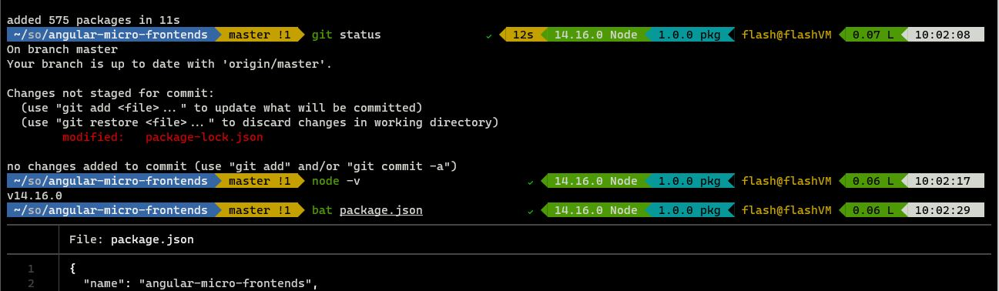

# Dotfiles for fast init

## Usage

- Just copy the stuff you need to ~
- Install zsh
- Install a font with powerline support (I'm using [Cascade Code](https://github.com/microsoft/cascadia-code))
- Done.

## Contents

- [oh-my-zsh](https://github.com/ohmyzsh/ohmyzsh) with enabled plugins:
  - zsh-autosuggestions 
  - zsh-completions 
  - zsh-syntax-highlighting 
  - zsh-navigation-tools
  - [colorized-man-pages](https://github.com/ohmyzsh/ohmyzsh/tree/master/plugins/colored-man-pages)
  - [sudo](https://github.com/ohmyzsh/ohmyzsh/tree/master/plugins/sudo)
  - [powerlevel10k](https://github.com/romkatv/powerlevel10k) 
- optimized npmrc config
- vim config

```bash
# first run this 
sh -c "$(curl -fsSL https://raw.githubusercontent.com/ohmyzsh/ohmyzsh/master/tools/install.sh)"

# download the config files install all the addons
curl -o- https://raw.githubusercontent.com/nvm-sh/nvm/v0.37.2/install.sh | bash && \
curl -LOJ https://raw.githubusercontent.com/flash-me/dots/master/.vimrc && \
curl -LOJ https://raw.githubusercontent.com/flash-me/dots/master/.p10k.zsh && \
curl -LOJ https://raw.githubusercontent.com/flash-me/dots/master/.npmrc && \
curl -LOJ https://raw.githubusercontent.com/flash-me/dots/master/.zshrc && \
git clone --depth=1 https://github.com/zsh-users/zsh-autosuggestions ${ZSH_CUSTOM:-~/.oh-my-zsh/custom}/plugins/zsh-autosuggestions && \
git clone --depth=1  https://github.com/zsh-users/zsh-completions ${ZSH_CUSTOM:=~/.oh-my-zsh/custom}/plugins/zsh-completions && \
git clone --depth=1  https://github.com/zsh-users/zsh-syntax-highlighting.git ${ZSH_CUSTOM:-~/.oh-my-zsh/custom}/plugins/zsh-syntax-highlighting && \
git clone --depth=1 https://github.com/romkatv/powerlevel10k.git ${ZSH_CUSTOM:-$HOME/.oh-my-zsh/custom}/themes/powerlevel10k && \
sh -c "$(curl -fsSL https://raw.githubusercontent.com/psprint/zsh-navigation-tools/master/doc/install.sh)" && \
autoload -U compinit && compinit

# restart session or source .zshrc
```

## Screenshot


